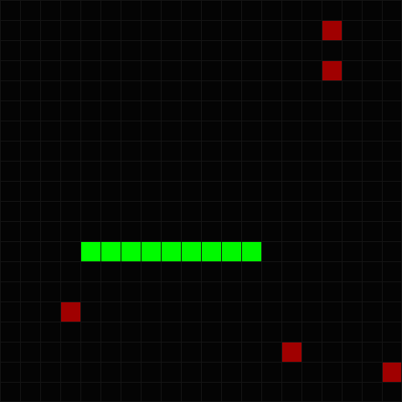

# Snake game

<p align="center">
  
</p>

## ✨ Особенности
- 🚀 Высокая производительность: Минимальное потребление ресурсов благодаря SDL2.
- 🎮 Плавное управление: Отзывчивый ввод без задержек.
- 📏 Модульная архитектура: Код легко расширять (добавлять уровни, скины или врагов).

## 🛠 Требования
Для сборки и запуска вам понадобятся:
- Компилятор: GCC 7+, Clang 5+ или MSVC 2017+.
- Библиотеки: 
  - SDL2 (Core library)

## 📥 Сборка и запуск
### Arch linux 
```shell
sudo pacman -S sdl2 clang
git clone https://github.com/mental0-main/snake.git
cd snake
clang++ -o snake_game *.cpp -lSDL2
./snake_game
```

### Debian linux 
```shell
sudo apt install libsdl2-dev clang
git clone https://github.com/mental0-main/snake.git
cd snake
clang++ -o snake_game *.cpp -lSDL2
./snake_game
```

### 🪟 Windows
1. Скачайте SDL2 Development Libraries с [официального сайта](https://www.libsdl.org/).
2. Подключите пути к include и lib в вашей IDE (Visual Studio, CLion).
3. Убедитесь, что SDL2.dll находится рядом с .exe файлом.

| Клавиша | Действие |
| :--- | :--- |
| W / Up | Движение вверх |
| S / Down | Движение вниз |
| A / Left | Движение влево |
| D / Right | Движение вправо |
| Esc | Выход из игры |

## 📜 Лицензия
Этот проект распространяется под лицензией MIT. 